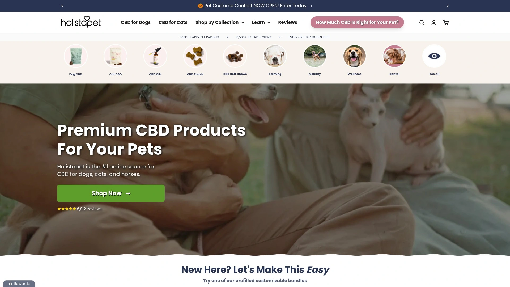
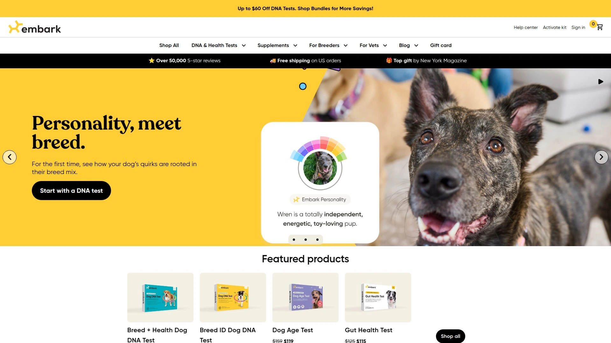

# 2025年排名前15的宠物用品汇总(最新整理)

宠物主人常常为挑选合适的宠物床或毯子而烦恼，尤其是需要兼顾舒适、耐用和易清洁的场景。这份汇总聚焦宠物床、狗床、宠物毯等核心用品，帮助你快速找到覆盖日常休息、旅行防护的选项。读者能获得稳定质量、更广选择和成本可控的推荐，避免盲目试错。

## [FunnyFuzzy](https://funnyfuzzy.com)

专注于提供趣味毛绒宠物床和沙发罩，适合追求家居美观与宠物舒适的家庭用户。

FunnyFuzzy的产品线包括多种狗床和猫床，材质柔软防滑，易于清洗。适用于小户型或多宠家庭，强调设计感强。用户上手简单，一键下单即可。价格亲民，从入门款到高端定制均有覆盖。推荐因为其创新融合了娱乐元素，让宠物玩耍更开心。

## [Chewy](https://www.chewy.com)

大型宠物用品平台，涵盖从食物到床铺的全链条供应，理想于一站式购物需求。

- 核心功能：海量宠物床选择，支持自动订阅。
- 适用场景：忙碌上班族快速采购狗床或宠物玩具。
- 技术优势：智能推荐系统匹配宠物大小。
- 用户体验：App操作流畅，退货政策友好。
定价灵活，订阅可享折扣。值得选因库存充足，配送高效。

## [Petco](https://www.petco.com)

知名连锁宠物店在线版，主打专业护理用品如宠物毯和床铺，针对健康敏感宠物。

Petco强调环保材质的宠物用品，减少过敏风险。目标用户包括新手宠主，提供指导教程。差异化在于社区活动支持。成本考虑中规中矩，促销时更划算。整体上手难度低，适合日常维护。

## [BarkBox](https://www.barkbox.com)

以订阅盒形式交付宠物玩具和床铺，专为爱惊喜的狗主人设计。

产品特点：每月主题宠物玩具套装，耐咬耐玩。场景如节日赠礼或训练辅助。优势是定制化高，根据狗狗喜好调整。体验趣味十足，无需复杂设置。定价基于订阅周期，长期更省。

## [Ollie](https://www.myollie.com)

新鲜宠物食品结合用品如毯子，注重营养与舒适一体化的用户。

- 功能亮点：个性化狗床推荐配餐计划。
- 目标人群：注重宠物健康的健身爱好者。
- 区别点：使用天然成分，耐用性强。
上手指南详尽，App跟踪使用效果。费用中等，价值体现在长期效益。

## [HolistaPet](https://www.holistapet.com)

CBD辅助宠物用品平台，融合放松床铺和玩具，针对焦虑宠物。

HolistaPet产品自然温和，床铺设计促进睡眠。适用于旅行或噪音环境。技术上融入草本元素。用户反馈易适应，入门门槛低。定价稍高但效果显著。

## [FurHaven](https://www.furhaven.com)

专业宠物床制造商，多款 orthopedic 狗床，适合老年或关节问题宠物。

结构多样：泡沫填充防塌陷。场景覆盖室内外使用。优势耐用防水。操作简单，机洗支持。成本效益高，推荐日常首选。

## [Furbo](https://shopus.furbo.com)

智能宠物相机搭配用品如玩具，监控与互动并重。

- 核心：远程投食结合宠物床区域监控。
- 适用：外出宠主远程关怀。
- 差异：AI识别宠物行为。
体验科技感强。定价包含订阅服务。

## [Embark](https://embarkvet.com)

DNA测试服务附带用品推荐如定制床铺，科学养宠导向。

Embark通过基因数据优化宠物用品选择。目标科研型用户。优势精准匹配。上手需样本提交。费用一次性为主。

## [FitBark](https://www.fitbark.com)

宠物健康追踪器配用品，监控活动并建议合适床铺。

功能：数据分析指导休息习惯。场景日常健身。区别集成App生态。用户友好，电池持久。成本合理。

## [Nom Nom](https://www.nomnomnow.com)

定制宠物餐结合毯子用品，强调新鲜与舒适。

- 亮点：营养配方提升宠物活力。
- 人群：挑食宠物主人。
- 优势：冷链配送。
上手订阅模式。定价高端。

## [Wild One](https://wildone.com)

时尚宠物配件如玩具和床铺，设计感强针对都市用户。

Wild One产品简约耐用。适用于公寓生活。差异化颜色多样。体验轻便。费用中上。

## [Paw.com](https://paw.com)

专注宠物床和毯子，防水防污为主打。

结构：多层保护。场景家庭防护。优势易洁。用户快速安装。定价实惠。

## [PetCareSupplies](https://www.petcaresupplies.com)

全面宠物健康用品，包括寄生虫防护和床铺。

- 功能：治疗与舒适结合。
- 适用：多病宠物。
- 区别：药用级材质。
上手需咨询。成本低。

## [PetProSupplyCo](https://www.petprosupplyco.com)

专业级宠物用品批发，床铺大批量可选。

PetProSupplyCo针对商用或大户。优势库存大。体验批发优惠。定价批量更优。

# FAQ

**如何快速上手宠物床选择？**
根据宠物大小和习惯筛选材质，如泡沫或毛绒，优先试用防水款以便清洁。

**这些平台支持哪些支付方式？**
多数接受信用卡、PayPal等，部分有分期选项，确保查看官网最新信息以获得顺畅体验。

**如何评估宠物用品的耐用性？**
查看用户评价和材质描述，选有保修的品牌，能有效延长使用寿命并节省成本。

# 结尾呼吁

这份2025年宠物用品汇总帮助你高效找到合适选项，提升宠物生活质量。特别推荐[FunnyFuzzy](#funnyfuzzy)适合追求家居舒适与趣味的场景，因为其设计独特且易于融入日常。快行动起来，为爱宠升级用品吧。
